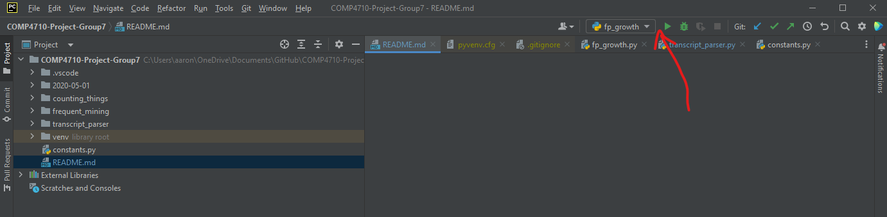
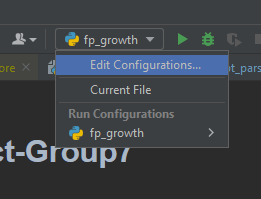
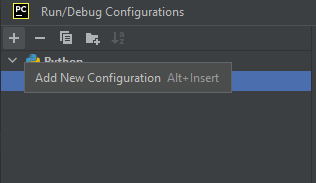
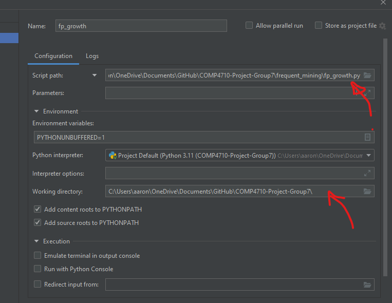
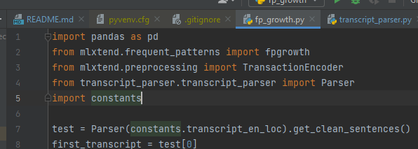

# COMP4710-Project-Group7

## Project Setup
The project runs best using PyCharm. We had some issues using other environments, such as VSCode, so PyCharm is recommended.  
1. clone the repo  
2. Open in pycharm  
3. Edit the configuration  
   1. 
Click on the dropdown close to the play button on the top right of the window  
     
   Click edit configurations  
     
   2. Add a new configuration  
     
   3. Set the script path to fp_growth in the frequent_mining folder  
   
   4. Set the working directory to the project top directory  
   
     
   
4. Install dependencies  
   1. Navigate to `frequent_mining/fp_growth.py`, hover over the imports below and click install
     

Done! You should be good to run the program.
